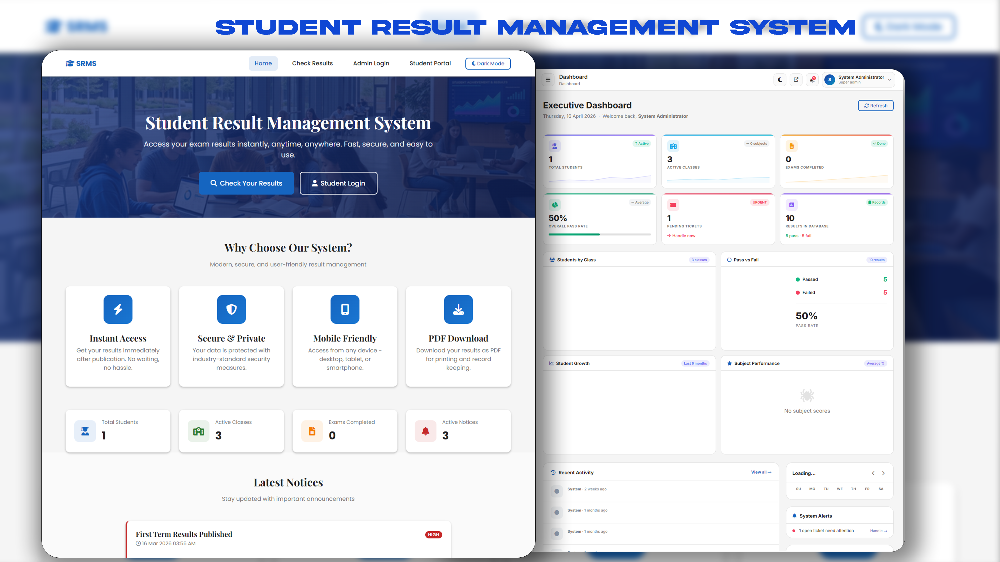

# SRMS — Professional Student Result Management System

  

  <strong>A high-performance, secure, and modern result management platform for educational institutions.</strong>

  
  
  
  

---

  <h2>🛒 Get the Full Source Code</h2>
  <a href="[https://vishaldev1.gumroad.com/l/course-management-system](https://vishaldev1.gumroad.com/l/student-result-management-system)"> <!-- Keeping their link structure but user should update if needed -->
    
  </a>
   
  <em>This repository is a visual showcase. To launch your own institution's platform with the fully functional PHP backend and all databases, purchase the premium source code above.</em>

---

## 🌟 Visual Preview

### 🖥️ Institutional Landing Page

*Professional, high-performance landing page with public result search functionality.*

### 🎭 Multi-Role Portals
| Student Dashboard | Admin Dashboard | Portal Login |
| :---: | :---: | :---: |
|  |  |  |

### 📊 Result Management & Exports
| Result Search | Subject-wise Result | PDF Export |
| :---: | :---: | :---: |
|  |  |  |

---

## 🚀 Key Features

- 🔐 **Secure Administration** — Role-based access control with bcrypt password hashing and session security.
- 👨‍🏫 **Dynamic Result Processing** — One-click publishing/unpublishing of results for specific student cohorts.
- 🎓 **Student Experience** — High-performance dashboard for personal result history and instant PDF downloads.
- 🏢 **Academic Structure** — Complete management of Classes, Subjects, and Exams with structured relationships.
- 📥 **Bulk Import/Export** — Streamlined data management with CSV templates for students and results.
- 🎨 **Modern UI/UX** — Premium glassmorphism aesthetics with persistent Dark Mode support.
- 📱 **Fully Responsive** — Optimized for seamless performance on smartphones, tablets, and desktops.
- 📑 **Professional PDF Engine** — High-resolution, institution-ready result slips generated instantly.
- 🌙 **Persistent Theming** — Theme engine that remembers user preferences automatically.

---

## 🛠️ Technical Stack

- **Backend**: PHP 8.2+ (Secure MySQLi / PDO ready)
- **Database**: MySQL 8.0+ (Optimized schema with 16+ tables)
- **Styling**: Vanilla CSS3 (Modern Custom Properties & Variables)
- **Icons**: Font Awesome 6.5 (High-fidelity vectors)
- **Theming**: Integrated Dark/Light mode engine

---

## 📄 License & Terms

**Copyright © 2026 Vishal Pawar. All Rights Reserved.**

This project is intended for personal review and portfolio evaluation. For any other use, modification, or redistribution, explicit permission must be obtained from the author. 

See [LICENSE](LICENSE) for full details.

---

© 2026 SRMS. Built with passion for modern educational standards.
